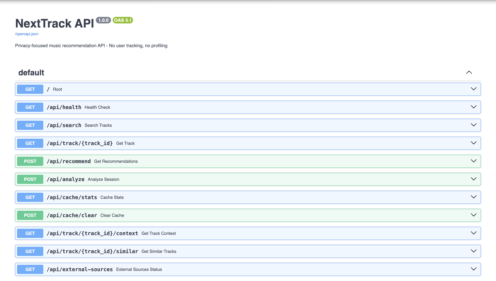
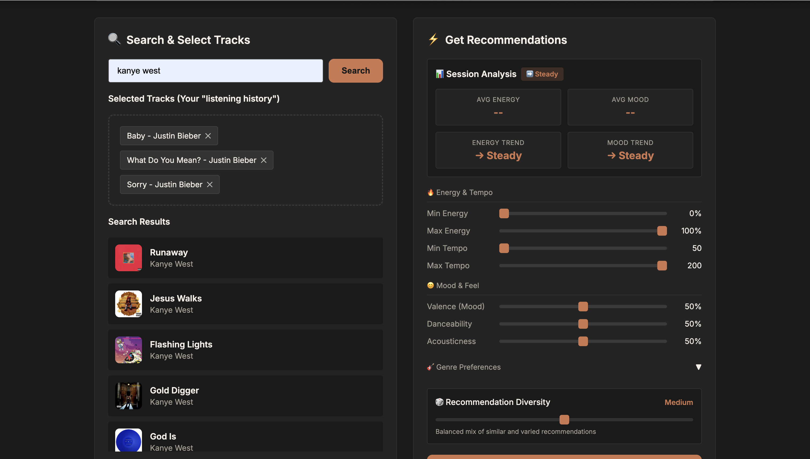

# NextTrack: A Privacy-Focused Music Recommendation API

## CM3035 Advanced Web Design — Draft Report

---

**Project Type:** RESTful API Development
**Course:** CM3035 Advanced Web Design
**Date:** February 2026
**Word Count:** ~8,700 words (excluding references, figures and tables)

---

## Table of Contents

1. [Introduction](#chapter-1-introduction)
2. [Literature Review](#chapter-2-literature-review)
3. [Design](#chapter-3-design)
4. [Implementation](#chapter-4-implementation)
5. [Evaluation](#chapter-5-evaluation)
6. [Conclusion](#chapter-6-conclusion)
7. [References](#references)

---

# Chapter 1: Introduction

## 1.1 Project Overview

NextTrack is a privacy-focused music recommendation API that provides intelligent "next track" suggestions without requiring user tracking, profiling, or data retention. The project addresses a critical gap in the contemporary music streaming landscape, where recommendation systems universally depend on building comprehensive user profiles through continuous behavioural monitoring. NextTrack instead operates statelessly: each API request carries a sequence of recently played track identifiers together with explicit preference parameters, and no information persists between requests. This approach enables high-quality music recommendations while eliminating the privacy concerns associated with persistent user profiling.

## 1.2 Project Template

This project follows the **RESTful API Development** template, focusing on the design and implementation of a web service that adheres to REST architectural principles. The project encompasses API endpoint design and implementation, integration with five external data sources (Spotify Web API, MusicBrainz, Wikidata, Genius.com, and Last.fm), algorithm development for multi-strategy recommendation logic, a web-based demonstration interface built in vanilla HTML/CSS/JavaScript, comprehensive automated test coverage using pytest, and automatic OpenAPI documentation generated by the FastAPI framework. This template was selected because it aligns directly with the course objectives of CM3035 Advanced Web Design, emphasising practical web service development, API design patterns, and the integration of multiple web technologies. The RESTful API approach is particularly well-suited to the music recommendation domain because it naturally supports stateless interaction — each recommendation request is self-contained, requiring no stored session context — which directly enables the project's privacy-preserving goals.

## 1.3 Motivation

The motivation for NextTrack stems from three interconnected concerns prevalent in modern music streaming services.

### Privacy Erosion

Contemporary recommendation systems such as those employed by Spotify, Apple Music, and YouTube Music continuously monitor user behaviour. Every play, skip, pause, and playlist addition is logged, analysed, and used to build increasingly detailed user profiles. While this enables personalised recommendations, it raises significant privacy concerns, particularly in light of the General Data Protection Regulation (GDPR) and similar legislation worldwide. Users have limited visibility into what data is collected and how it is used, creating an asymmetric relationship between platforms and users (Schedl et al., 2018). The 2021 revelations about Spotify's podcast analytics capabilities further underscored the depth of behavioural tracking embedded in modern streaming platforms (Vincent, 2021).

### Shared Context Contamination

A significant limitation of profile-based recommendation systems emerges in shared listening contexts. Family accounts, shared devices, or situations where music is played for groups result in listening histories that do not represent any single individual's preferences. A parent playing children's music, a host selecting party tracks, or a shared car stereo all contribute to profile pollution that degrades recommendation quality. Traditional systems cannot distinguish between deliberate personal choices and contextual or shared listening. NextTrack's stateless approach inherently avoids this problem by considering only the explicitly provided listening context with each request.

### Platform Lock-in

Recommendation quality has become a differentiating feature for music streaming platforms, creating artificial barriers to platform switching. Users who have invested years building a listening history on one platform face losing all personalisation benefits when moving to a competitor. A platform-agnostic recommendation API that requires no stored history democratises access to intelligent music suggestions and empowers users to switch freely between services.

## 1.4 Scope and Constraints

The project operates within several deliberate constraints that shape its design. First, NextTrack is a recommendation API rather than a full music player — it suggests tracks but delegates playback to existing platforms via external links. Second, the system uses Spotify's Client Credentials authentication flow rather than user-level OAuth, which provides access to the public catalogue but not to individual user data. This constraint is privacy-enabling but means the system cannot access personalised endpoints. Third, the project targets a prototype-level deployment rather than production scale — it demonstrates the architectural pattern and recommendation quality but does not address concerns such as horizontal scaling, load balancing, or continuous deployment. These constraints focus the project on its core contribution: demonstrating that stateless, multi-source recommendations are viable.

## 1.5 Project Objectives

The primary objectives of NextTrack are:

1. **Develop a functional RESTful API** that accepts track identifiers and preference parameters, returning intelligent next-track recommendations.
2. **Maintain complete user privacy** through stateless operation with no data retention between requests.
3. **Integrate multiple external music data sources** — specifically Spotify Web API, MusicBrainz, Wikidata, Genius.com, and Last.fm — to inform recommendation logic from diverse perspectives.
4. **Implement recommendation algorithms** that demonstrably outperform random selection, using a multi-strategy approach.
5. **Create a web-based demonstration interface** showcasing practical API usage.
6. **Document the API comprehensively** with automated OpenAPI specifications.
7. **Develop a comprehensive test suite** ensuring reliability and maintainability.

## 1.6 Report Structure

This report is organised into six chapters. Following this introduction, Chapter 2 presents a literature review examining existing work in music recommendation, REST architecture, and privacy-preserving systems. Chapter 3 details the system design, including architecture, API specifications, and recommendation strategies. Chapter 4 describes the implementation, covering the technology stack, key algorithms, and code organisation. Chapter 5 presents evaluation results from automated testing, performance benchmarking, and a user study. Chapter 6 provides conclusions and discusses future work.

---

# Chapter 2: Literature Review

## 2.1 Introduction

This literature review examines the academic and industry foundations relevant to developing NextTrack, a privacy-focused music recommendation API. The review is organised into four main areas: music recommendation systems and their evolution, REST API architectural principles, privacy considerations in recommendation systems, and the open music data sources that power NextTrack's recommendations.

## 2.2 Music Recommendation Systems

### 2.2.1 Historical Development

Music recommendation has been an active research area since the early days of digital music distribution. Collaborative filtering, pioneered by systems like GroupLens and applied to music through platforms such as Last.fm, recommends items based on the preferences of similar users (Resnick et al., 1994). The core assumption is that users who agreed in the past will agree in the future. While powerful, this approach requires substantial user interaction data and suffers from cold-start problems for new users or obscure tracks — both antithetical to privacy preservation.

Content-based filtering takes a fundamentally different approach by analysing item characteristics rather than user behaviour. Whitman and Lawrence (2002) demonstrated that effective music recommendations could be generated using non-audio features such as metadata, artist descriptions, and social context. This finding is particularly relevant to NextTrack, as it suggests high-quality recommendations are achievable without deep audio analysis or persistent user profiles. The content-based approach does suffer from a "filter bubble" risk — if recommendations are based solely on existing preferences, users may never be exposed to genuinely novel music — but this can be mitigated through deliberate diversity injection, as NextTrack implements.

### 2.2.2 Modern Approaches

Contemporary music recommendation systems typically employ hybrid approaches combining multiple techniques. Schedl et al. (2018) provide a comprehensive survey of current challenges and approaches in music recommender systems research, identifying several key areas of development.

**Context-aware recommendations** consider factors beyond static user preferences, including time of day, location, activity, and social context. Kaminskas and Ricci (2012) demonstrate that contextual information significantly improves recommendation relevance. This concept directly influences NextTrack's design, which accepts explicit context parameters — energy level, tempo preferences — with each request rather than inferring context from a stored profile.

**Sequence-aware recommendations** analyse the order of played tracks to understand listening sessions and predict appropriate continuations. Quadrana et al. (2018) survey session-based recommendation systems, noting that sequential patterns often reveal temporary preferences distinct from long-term taste profiles. This aligns with NextTrack's focus on recent listening sequences rather than historical profiles — the API receives an ordered list of recently played tracks and uses recency weighting to prioritise the most recent selections.

**Audio feature analysis** has advanced significantly with deep learning. Van den Oord et al. (2013) demonstrated that convolutional neural networks could learn meaningful audio representations for recommendation. However, access to pre-computed audio features via platform APIs has historically made this computationally intensive approach less necessary for application-level systems. The late-2024 deprecation of Spotify's audio features endpoint for new applications has renewed interest in alternative approaches to inferring musical characteristics, including tag-based estimation and collaborative filtering signals. This deprecation is particularly significant because it demonstrates the fragility of building recommendation systems that depend heavily on a single commercial API — a risk that NextTrack's multi-source architecture explicitly addresses.

### 2.2.3 Knowledge-Graph-Based Recommendations

An emerging approach to music recommendation leverages knowledge graphs — structured representations of relationships between entities — to discover connections that purely audio-based or collaborative filtering methods would miss. Knowledge graphs such as Wikidata encode artist influence relationships, genre hierarchies, geographical origins, and temporal context. These relationships enable recommendations based on cultural affinity rather than surface-level similarity: an artist may be recommended not because their music sounds similar to the input, but because they were influenced by the same musicians, emerged from the same musical movement, or share a genre lineage. This approach aligns with how human music discovery often works — through cultural context and social recommendation rather than acoustic similarity alone. NextTrack integrates Wikidata's knowledge graph to access precisely these kinds of relationships.

### 2.2.4 Evaluation Methodologies

Evaluating recommendation systems presents unique challenges, as traditional accuracy metrics may not capture user satisfaction. Herlocker et al. (2004) provide foundational work on evaluating collaborative filtering systems, distinguishing between accuracy metrics (precision, recall, RMSE) and user-centric measures (satisfaction, trust, diversity). More recent work emphasises the importance of diversity and serendipity alongside accuracy. Zhang et al. (2012) argue that recommendations should balance relevance with discovery, avoiding "filter bubbles" that restrict user exposure to new music. This consideration directly informs NextTrack's inclusion of a configurable diversity injection strategy, ensuring recommendations do not become excessively homogeneous.

## 2.3 REST API Architecture

### 2.3.1 Foundational Principles

Representational State Transfer (REST) was formally defined by Roy Fielding in his doctoral dissertation (Fielding, 2000) as an architectural style for distributed hypermedia systems. REST is characterised by six constraints: client-server separation, statelessness, cacheability, a uniform interface, a layered system, and optional code on demand. The statelessness constraint is particularly significant for NextTrack. Fielding explicitly states that "each request from client to server must contain all of the information necessary to understand the request, and cannot take advantage of any stored context on the server." This architectural requirement aligns perfectly with NextTrack's privacy-preserving design philosophy — what REST mandates for scalability, NextTrack embraces for privacy.

### 2.3.2 API Design Best Practices

Modern API design has evolved beyond Fielding's original work to establish practical patterns for web service development. Richardson and Ruby (2007) provide comprehensive guidance on RESTful web services, emphasising resource-oriented design and appropriate HTTP method usage. The OpenAPI Specification has emerged as the industry standard for API documentation (OpenAPI Initiative, 2021), enabling automatic generation of interactive documentation, client libraries, and testing tools. NextTrack adopts OpenAPI 3.0 specification through FastAPI's automatic documentation generation, exposing both Swagger UI and ReDoc interfaces at `/docs` and `/redoc` respectively.

### 2.3.3 API Security Considerations

Even stateless APIs require security measures. OWASP (2019) identifies common API vulnerabilities including injection attacks, broken authentication, and excessive data exposure. While NextTrack's stateless design eliminates user session management complexity, appropriate input validation via Pydantic models, CORS configuration, and rate limiting remain essential. The system employs strict request validation with type-checked schemas, preventing malformed inputs from reaching the recommendation engine. Masse (2011) provides additional practical guidance on REST API design, emphasising the importance of consistent error response formats and appropriate HTTP status code usage — principles that NextTrack follows by returning structured JSON error responses with 422 (validation error) and 500 (server error) status codes.

## 2.4 Privacy in Recommendation Systems

### 2.4.1 Privacy Concerns in Music Streaming

Music listening data reveals surprisingly intimate information about users. Kosinski et al. (2013) demonstrated that digital footprints, including music preferences, can predict sensitive personal attributes — personality traits, political leanings, and emotional states — with concerning accuracy. This finding underscores the privacy implications of centralised listening profile collection by streaming platforms.

### 2.4.2 Privacy-Preserving Approaches

Several approaches to privacy-preserving recommendations have been proposed. **Differential privacy** adds calibrated noise to data to protect individual records while maintaining aggregate utility (Dwork, 2006). McSherry and Mironov (2009) applied this approach to recommendation systems, though it typically still requires centralised data collection. **Federated learning** keeps user data on local devices while training shared models (McMahan et al., 2017). While promising, this approach still requires user identification and cross-device coordination. **Stateless recommendation** represents the most aggressive privacy-preserving approach, eliminating all server-side user data. While academically explored (Berkovsky et al., 2012), commercial implementations remain rare. NextTrack contributes to this underexplored area by demonstrating that effective recommendations are achievable without any user profiling, using a combination of content-based signals, collaborative filtering via Last.fm, and knowledge-graph relationships via Wikidata.

### 2.4.3 Regulatory Context

The GDPR (European Parliament, 2016) establishes strict requirements for personal data processing. Article 25 mandates "data protection by design and by default," a principle that NextTrack embodies through its stateless architecture. The California Consumer Privacy Act (CCPA) and similar legislation worldwide indicate a global trend toward stronger privacy protections. Systems designed with privacy as a core architectural principle rather than an afterthought are better positioned for this evolving regulatory landscape.

## 2.5 Open Music Data Sources

### 2.5.1 MusicBrainz

MusicBrainz is an open music encyclopedia that collects and provides rich music metadata under Creative Commons licensing (MusicBrainz, 2023). Its community-maintained database contains artist information, recording data, genre tags, and relationship links. The stable identifier system enables reliable cross-referencing with other data sources. For NextTrack, MusicBrainz provides genre classification and tag-based artist discovery — critical capabilities since Spotify deprecated its recommendations endpoint.

### 2.5.2 Wikidata

Wikidata's knowledge graph provides structured information about artists, including influence relationships, genre hierarchies, and temporal context (Wikidata, 2023). SPARQL queries enable sophisticated relationship discovery — for instance, finding artists influenced by a given musician, or exploring genre parent-child hierarchies. This contextual richness enables recommendations that consider cultural and historical relationships beyond surface-level metadata similarity.

### 2.5.3 Spotify Web API

Spotify's Web API provides access to track search and metadata including artist names, album information, and popularity scores (Spotify, 2023). In late 2024, Spotify deprecated several key endpoints — `/audio-features`, `/recommendations`, and `/artists/{id}/related-artists` — for applications using Client Credentials authentication. This industry shift forced NextTrack to develop alternative approaches using open data sources, ultimately resulting in a more resilient and diverse recommendation architecture.

### 2.5.4 Last.fm

Last.fm provides collaborative filtering signals through its "similar tracks" endpoint, reflecting the listening patterns of millions of users. Its tag system enables community-driven genre and mood classification. NextTrack uses Last.fm to estimate audio features from tags when Spotify's audio features are unavailable, and to discover similar tracks via collaborative filtering — users who listened to track A also listened to track B (Last.fm, 2023). The collaborative filtering signal from Last.fm is complementary to the content-based signals from other sources: while MusicBrainz and Wikidata identify relationships based on metadata and knowledge graphs, Last.fm captures empirical listening behaviour, revealing connections that may not be apparent from metadata alone. For example, two tracks from different genres might be frequently listened to in sequence due to a shared mood or tempo, a pattern that Last.fm's data can capture but that genre-based matching would miss.

### 2.5.5 Genius.com

Genius.com provides contextual metadata including song descriptions, community annotations, and genre classifications. While not a primary source for recommendation scoring, Genius enriches the metadata available for recommended tracks, enabling the API to return contextual information (such as the song's cultural significance or thematic content) alongside recommendations. This contextual enrichment addresses a gap identified in the evaluation of recommendation systems — users appreciate understanding why a track was recommended, and Genius's descriptive content supports this transparency.

## 2.6 Critical Analysis

The literature reveals several gaps that NextTrack addresses. First, the widely held assumption that effective recommendations require extensive user profiling is challenged by evidence from content-based and context-aware systems. NextTrack tests this assumption directly. Second, despite academic interest in session-based recommendation, commercial systems remain primarily profile-based; NextTrack's focus on immediate listening context represents practical application of this research direction. Third, academic work frequently depends on proprietary datasets, whereas NextTrack's integration of open sources (MusicBrainz, Wikidata, Last.fm) with commercial APIs demonstrates a reproducible approach to building recommendation systems. Finally, the late-2024 Spotify API deprecations highlight the fragility of depending on a single commercial data source — NextTrack's multi-source architecture demonstrates resilience through diversity.

---

# Chapter 3: Design

## 3.1 System Architecture Overview

NextTrack employs a three-tier architecture designed for modularity, maintainability, and graceful degradation. The architecture separates concerns into distinct layers, each with well-defined responsibilities and interfaces.

```
┌───────────────────────────────────────────────────────────────────┐
│                      Client Applications                          │
│                (Web Demo UI, Third-party Apps)                    │
└───────────────────────────────────────────────────────────────────┘
                                │
                                ▼
┌───────────────────────────────────────────────────────────────────┐
│                         API Layer (FastAPI)                        │
│  ┌──────────────┐  ┌───────────────┐  ┌────────────────────────┐ │
│  │   Routing    │  │  Validation   │  │  Response Handling     │ │
│  │  & Endpoints │  │  (Pydantic)   │  │  & Error Recovery      │ │
│  └──────────────┘  └───────────────┘  └────────────────────────┘ │
└───────────────────────────────────────────────────────────────────┘
                                │
                                ▼
┌───────────────────────────────────────────────────────────────────┐
│              Enhanced Recommendation Engine                       │
│  ┌──────────────┐  ┌───────────────┐  ┌────────────────────────┐ │
│  │  Strategy    │  │   Scoring     │  │  Diversity Injection   │ │
│  │  Selection   │  │   Engine      │  │  & Re-ranking          │ │
│  └──────────────┘  └───────────────┘  └────────────────────────┘ │
└───────────────────────────────────────────────────────────────────┘
                                │
                                ▼
┌───────────────────────────────────────────────────────────────────┐
│                    Data Integration Layer                          │
│  ┌─────────┐ ┌───────────┐ ┌──────────┐ ┌────────┐ ┌─────────┐ │
│  │ Spotify │ │MusicBrainz│ │ Wikidata │ │ Genius │ │ Last.fm │ │
│  └─────────┘ └───────────┘ └──────────┘ └────────┘ └─────────┘ │
│                         │                                         │
│                ┌────────────────┐                                 │
│                │  Cache Layer   │                                 │
│                │ (Redis / Mem)  │                                 │
│                └────────────────┘                                 │
└───────────────────────────────────────────────────────────────────┘
```

*Figure 1: NextTrack three-tier architecture with five external data source integrations and a caching layer.*

### 3.1.1 API Layer

The API layer handles all external communication, implementing RESTful endpoints using Python's FastAPI framework. FastAPI was selected for four key reasons: automatic OpenAPI documentation generation (eliminating manual API specification maintenance), built-in request validation via Pydantic (catching malformed requests before they reach the business logic), high performance through asynchronous request handling with `async`/`await` (enabling non-blocking I/O during external API calls), and native support for serving static files (used for the web demonstration interface). Key responsibilities include request routing and parameter extraction, input validation using typed Pydantic models that enforce field constraints (e.g., track ID lists limited to 1–10 items, result limits clamped to 1–50), response serialisation with consistent JSON structure, comprehensive error handling with appropriate HTTP status codes, CORS middleware configuration for cross-origin web client access, and serving the static demonstration interface at the root URL.

The application lifecycle is managed through an `asynccontextmanager` that initialises all external API clients on startup and gracefully closes their HTTP connections on shutdown. This pattern ensures resource cleanup even during unexpected shutdowns and centralises client configuration.

### 3.1.2 Recommendation Engine

The recommendation engine contains the core business logic. It is implemented as two classes — a base `RecommendationEngine` for single-source recommendations and an `EnhancedRecommendationEngine` that extends this with multi-source strategies. The selection between engines is controlled by an environment variable (`USE_ENHANCED_ENGINE`), allowing deployment flexibility. The enhanced engine operates as a seven-stage pipeline: (1) fetch input tracks with metadata from Spotify, (2) build a recommendation context aggregating artist genres from MusicBrainz and computing a feature centroid from available audio data, (3) generate candidate tracks from three sources — artist-name search, genre-based search via MusicBrainz, and related-artist search, (4) fetch audio features for all candidates with graceful fallback to Last.fm tag-based estimation, (5) retrieve genre tags for candidates from MusicBrainz, (6) score candidates across all strategies with a weighted combination and apply preference filters, and (7) apply diversity injection via greedy MMR re-ranking. This modular design follows the Open/Closed Principle — new recommendation strategies can be added without modifying existing scoring logic.

### 3.1.3 Data Integration Layer

Each external API connector is implemented as a self-contained client class with its own authentication mechanism, rate limiting logic, data transformation pipeline, and error recovery strategy. This isolation ensures that failures in one connector do not cascade to others. The connectors present consistent internal interfaces — each returns typed dataclass instances regardless of the underlying API's response format — enabling the recommendation engine to treat all data sources uniformly.

A dual-backend caching layer sits between the connectors and the external APIs. The `CacheManager` class attempts to connect to Redis on startup; if Redis is unavailable, it transparently falls back to an in-memory dictionary with LRU-like eviction when the cache exceeds 1,000 entries. A `@cached` decorator provides transparent function-level caching with MD5-hashed argument keys and category-specific TTL values. The cache tracks hit, miss, and error statistics, which are exposed via a dedicated API endpoint for operational monitoring. This design ensures the system operates correctly in all deployment scenarios — from a developer's laptop (in-memory cache) to a production environment (Redis).

## 3.2 API Specification

### 3.2.1 Resource Model

NextTrack exposes eight RESTful endpoints:

| Endpoint | Method | Description |
|----------|--------|-------------|
| `/api/health` | GET | Service health and external source connectivity |
| `/api/search` | GET | Search tracks by query string via Spotify |
| `/api/track/{id}` | GET | Retrieve detailed track metadata |
| `/api/recommend` | POST | Generate stateless recommendations |
| `/api/analyze` | POST | Analyse session trends (energy, mood, tempo) |
| `/api/track/{id}/similar` | GET | Last.fm collaborative filtering similarity |
| `/api/external-sources` | GET | Status of all external integrations |
| `/api/cache/stats` | GET | Cache hit/miss statistics |

*Table 1: NextTrack API endpoint summary.*

### 3.2.2 Recommendation Request/Response

The core recommendation endpoint (`POST /api/recommend`) accepts a JSON body containing an array of 1–10 Spotify track IDs, optional preference filters (energy range, tempo range, valence, danceability), and a result limit (1–50). The response includes ranked recommendations, each with a confidence score, human-readable reasoning, and the computed feature centroid.

### 3.2.3 Design Rationale for POST

The recommendation endpoint uses `POST` rather than `GET` despite being an idempotent read operation. This decision was made because the request payload — containing a variable-length array of track IDs and nested preference objects — exceeds what is practical to encode as URL query parameters. The POST body provides a structured JSON schema that is self-documenting via OpenAPI, type-checked by Pydantic, and unconstrained by URL length limits. Since the operation is stateless and side-effect-free, it remains semantically safe regardless of the HTTP method used.

## 3.3 Recommendation Strategies

The enhanced engine combines six strategies with configurable weights:

### 3.3.1 Audio Feature Similarity

Given input tracks $T = \{t_1, t_2, \ldots, t_n\}$, the feature centroid $\mu$ is computed with recency weighting:

$$\mu = \frac{\sum_{i=1}^{n} w_i \cdot f(t_i)}{\sum_{i=1}^{n} w_i}$$

where $w_i = 0.5^{i}$ gives exponentially more weight to recent tracks. Candidate similarity is then scored using weighted Euclidean distance across eight audio dimensions (energy, valence, danceability, acousticness, tempo, instrumentalness, speechiness, liveness), each with a learned importance weight $\alpha_j$:

$$\text{similarity}(c, \mu) = 1 - \sqrt{\frac{\sum_{j} \alpha_j (c_j - \mu_j)^2}{\sum_{j} \alpha_j}}$$

When Spotify audio features are unavailable (due to API deprecation), the system falls back to Last.fm tag-based feature estimation, mapping community tags (e.g., "energetic", "acoustic", "upbeat") to pseudo-audio-feature vectors.

### 3.3.2 Artist-Based Discovery

Searches for additional tracks by artists present in the input. This is the primary discovery strategy following Spotify's deprecation of the `/recommendations` and `/related-artists` endpoints.

### 3.3.3 Genre Matching via MusicBrainz

Genre similarity is computed using the Jaccard coefficient on normalised genre sets:

$$J(A, B) = \frac{|A \cap B|}{|A \cup B|}$$

Genre strings are normalised to canonical forms (e.g., "hip-hop" → "hip hop", "rnb" → "r&b") before comparison to ensure consistent matching despite inconsistent tagging across data sources.

### 3.3.4 Cultural Context via Wikidata

SPARQL queries retrieve artist influence relationships, genre hierarchies, and era/temporal context from the Wikidata knowledge graph, enabling recommendations that consider cultural and historical relationships.

### 3.3.5 Last.fm Collaborative Filtering

Leverages Last.fm's "similar tracks" data, reflecting the aggregated listening patterns of millions of users ("listeners who liked this also liked…"), to discover related tracks that may not share obvious metadata similarities.

### 3.3.6 Diversity Injection

A greedy maximal marginal relevance (MMR) re-ranking algorithm prevents homogeneous results:

$$\text{score}'(c) = \text{score}(c) - \lambda \cdot \max_{s \in S} \text{sim}(c, s)$$

where $S$ is the set of already-selected recommendations and $\lambda$ (default 0.3) controls the diversity-relevance trade-off. The similarity function considers artist overlap, genre overlap (Jaccard), and audio feature distance.

## 3.4 Caching Strategy

The caching layer is designed to balance freshness with performance across data categories that have fundamentally different update frequencies. The design applies the principle of appropriate staleness — metadata that changes rarely (artist biographies, genre classifications) can be cached aggressively, while context-specific data (recommendation results, search queries) requires shorter TTLs.

| Data Category | TTL | Rationale |
|---------------|-----|-----------|
| Track/Artist metadata | 24 hours | Rarely changes; album info, artist names are stable |
| Search results | 1 hour | Catalogue updates; new releases should appear promptly |
| MusicBrainz/Wikidata | 1 week | Stable open data; community edits are infrequent |
| Recommendations | 5 minutes | Context-specific; users expect fresh results |

*Table 2: Cache TTL configuration by data category.*

The dual-backend design (Redis with in-memory fallback) ensures the system operates in all deployment environments. In a production setting with Redis, cached data persists across application restarts and can be shared across multiple server instances, enabling horizontal scaling. In development or single-instance deployments, the in-memory fallback provides equivalent functionality without requiring additional infrastructure. Cache keys are generated by hashing function arguments with MD5, ensuring deterministic key generation for identical requests while avoiding key collisions across different query parameters.

## 3.5 Data Flow

A single recommendation request triggers the following data flow: the client sends a POST request containing track IDs and optional preferences to the API layer. The API layer validates the request using Pydantic and forwards it to the recommendation engine. The engine first queries Spotify for track metadata (artist, album, popularity), then concurrently queries MusicBrainz for genre tags, Last.fm for audio feature estimates and similar tracks, and Wikidata for influence relationships. Each query first checks the cache layer — on a cache hit, the cached data is returned immediately; on a miss, the external API is queried and the result is cached for future requests. Once all data sources have responded (or timed out), the engine scores candidates across all strategies, applies preference filters and diversity injection, and returns ranked recommendations to the API layer. The API layer serialises the response as JSON, including processing time metadata, and sends it to the client. No data from the request is persisted after the response is sent.

## 3.5 Error Handling and Graceful Degradation

Every external service is optional. The system is designed so that no single external API failure can prevent it from returning results. If Spotify is unreachable, the health endpoint reports degraded status but the system can still attempt cached responses. If Last.fm, MusicBrainz, Wikidata, or Genius are unavailable, the engine disables dependent strategies and returns recommendations using the remaining available sources. This design ensures the system always returns some result rather than failing entirely.

Error handling follows a layered approach. At the connector level, each client class catches HTTP exceptions and returns empty or default values rather than propagating errors. At the engine level, the recommendation pipeline checks which data sources returned usable data and adjusts strategy weights accordingly — if MusicBrainz returns no genre tags, the genre matching weight is redistributed to other strategies. At the API level, FastAPI's exception handlers translate internal errors into structured JSON responses with appropriate HTTP status codes. This architecture means that from a client's perspective, the API always responds with a valid JSON structure, even when some data is degraded or unavailable.

## 3.6 Security Considerations

Although NextTrack's stateless design eliminates many common security concerns (session hijacking, stored credential theft), several security measures are implemented. All external API credentials are loaded from environment variables rather than hardcoded, following twelve-factor application principles. Pydantic models provide runtime type checking that prevents injection of unexpected data types — a malformed track ID or an out-of-range preference value is rejected with a 422 validation error before reaching any business logic. CORS middleware restricts cross-origin access to configured domains. Input arrays are length-limited (maximum 10 track IDs, maximum 50 results) to prevent resource exhaustion through oversized requests.

---

# Chapter 4: Implementation

## 4.1 Technology Stack

| Component | Technology | Rationale |
|-----------|------------|-----------|
| Backend Framework | FastAPI (Python 3.11) | Async support, automatic OpenAPI docs, Pydantic integration |
| HTTP Client | httpx (async) | Non-blocking I/O, connection pooling, timeout control |
| Data Validation | Pydantic v2 | Runtime type checking, serialisation, schema generation |
| Testing | pytest + pytest-asyncio | Industry standard, async test support, fixtures |
| Frontend | Vanilla HTML/CSS/JS | No build step, simplicity, responsive design |
| Caching | Redis (with in-memory fallback) | Low-latency key-value store; graceful fallback |

*Table 3: Technology stack with rationale.*

## 4.2 Project Structure

The codebase is organised into focused modules, each encapsulating a single responsibility:

```
src/
├── main.py                  # FastAPI app, endpoint definitions, lifecycle
├── engine.py                # Core recommendation engine, AudioFeatureSimilarity
├── enhanced_engine.py       # Multi-strategy engine, DiversityInjector
├── spotify_client.py        # Spotify Web API client, Track/AudioFeatures models
├── musicbrainz_client.py    # MusicBrainz client, genre normalisation utilities
├── wikidata_client.py       # Wikidata SPARQL client, artist/genre models
├── genius_client.py         # Genius.com context client, GeniusSong model
├── lastfm_client.py         # Last.fm collaborative filtering, tag-based estimation
├── cache.py                 # Redis/in-memory caching, @cached decorator
└── static/
    └── index.html           # Web demonstration interface
```

*Figure 2: Source code module organisation.*

## 4.3 Core Components

### 4.3.1 Spotify Client

The `SpotifyClient` class in [spotify_client.py](src/spotify_client.py) handles all Spotify Web API interactions. Authentication uses the Client Credentials flow (base64-encoded client ID and secret), which does not require user login and therefore collects no user data. The client implements several reliability mechanisms: automatic token refresh with a 60-second safety buffer before expiration, exponential backoff retry on HTTP 429 (rate limit) responses using the `Retry-After` header value, and batch operations for retrieving tracks (batches of 50) and audio features (batches of 100), minimising the number of API calls for large requests.

A critical design decision was the handling of Spotify's deprecated endpoints. The `get_audio_features()` method catches HTTP 403 responses from the deprecated `/audio-features` endpoint and silently returns an empty dictionary rather than raising an exception. This allows the rest of the pipeline to continue with alternative feature estimation from Last.fm, ensuring the system degrades smoothly rather than failing outright. The client also parses both raw Spotify IDs and full Spotify URIs (e.g., `spotify:track:abc123`), providing flexibility in how track identifiers are supplied by API consumers.

```python
class SpotifyClient:
    async def get_token(self) -> str:
        """Obtain or refresh access token using Client Credentials."""

    async def search_tracks(self, query: str, limit: int) -> List[Track]:
        """Search for tracks. Primary discovery mechanism."""

    async def get_tracks_with_features(self, track_ids: List[str]) -> List[Track]:
        """Batch-fetch tracks and attach audio features when available."""
```

### 4.3.2 Last.fm Client

The `LastFmClient` class in [lastfm_client.py](src/lastfm_client.py) provides the primary replacement for Spotify's deprecated endpoints. Its `get_similar_tracks()` method leverages Last.fm's collaborative filtering data — aggregated patterns from millions of listeners — to discover related tracks. The `estimate_audio_features_from_tags()` method maps community tags to pseudo-audio-feature vectors through keyword matching against curated tag categories. For example, tags containing "energetic", "power", or "upbeat" increase the energy estimate; tags containing "acoustic", "unplugged", or "folk" increase the acousticness estimate; and tags containing "happy", "feel good", or "cheerful" increase the valence estimate. Each feature dimension is computed as the proportion of tags matching its associated keywords, producing values in the [0, 1] range that are directly comparable to Spotify's normalised audio features. A `clean_track_name()` static method strips remaster and deluxe suffixes (e.g., "Bohemian Rhapsody - Remastered 2011" → "Bohemian Rhapsody") using regular expressions, improving cross-source matching accuracy.

```python
class LastFmClient:
    @staticmethod
    def clean_track_name(name: str) -> str:
        """Strip remaster/deluxe/single suffixes for better matching."""

    async def get_similar_tracks(self, artist: str, track: str,
                                  limit: int = 20) -> List[SimilarTrack]:
        """Collaborative filtering: 'listeners who liked this also liked...'"""

    async def estimate_audio_features_from_tags(self, artist: str,
                                                 track: str) -> Optional[Dict]:
        """Map Last.fm tags to pseudo-audio-feature vectors."""
```

### 4.3.3 MusicBrainz Client

The `MusicBrainzClient` class enforces MusicBrainz's rate limit of 1 request per second through an asynchronous semaphore with a 1.1-second inter-request delay. It provides artist search with genre tag extraction, and enables genre-based artist discovery — finding new artists who share genre tags with the input tracks. The module also includes utility functions for genre normalisation (canonicalising synonyms such as "hip-hop", "hiphop", and "hip hop" to a single form using a predefined synonym dictionary) and Jaccard similarity computation. The genre normalisation is essential because genre tags from different sources use inconsistent naming conventions; without normalisation, "r&b", "rnb", and "r and b" would be treated as distinct genres despite referring to the same musical style.

### 4.3.4 Wikidata Client

The `WikidataClient` constructs SPARQL queries against Wikidata's knowledge graph endpoint to retrieve artist influence relationships (`wdt:P737`), genre hierarchies via subclass relations (`wdt:P279`), and biographical context including birth year and country of origin. This enables recommendations informed by cultural relationships — for instance, recommending artists influenced by the same musicians as the input artists. The era similarity function uses a step function that assigns a similarity of 1.0 for artists active within 5 years of each other, decreasing to 0.8 (within 10 years), 0.6 (within 20 years), 0.4 (within 30 years), and 0.2 for artists more than 30 years apart. Importantly, the client filters Wikidata results to include only artists with associated Spotify IDs (`wdt:P1902`), ensuring that discovered artists can be played back through the system.

### 4.3.5 Enhanced Recommendation Engine

The `EnhancedRecommendationEngine` class in [enhanced_engine.py](src/enhanced_engine.py) orchestrates the full multi-strategy pipeline. Strategy weights are configurable: audio similarity (0.35), artist search (0.25), genre match (0.25), and cultural context (0.15). The recommendation pipeline proceeds through seven stages:

1. **Fetch input tracks** from Spotify with metadata.
2. **Build context** — aggregate artist genres from MusicBrainz, estimate feature centroid from Last.fm tags when Spotify features are unavailable.
3. **Generate candidates** from three sources: artist-name search, genre-based search via MusicBrainz, and related-artist search.
4. **Fetch audio features** for candidates (graceful fallback to Last.fm estimation).
5. **Retrieve genre tags** for candidates from MusicBrainz.
6. **Score candidates** across all strategies with weighted combination and preference filters.
7. **Apply diversity injection** via greedy MMR re-ranking.

The `MetadataMatchingStrategy` class scores candidates based on genre similarity (Jaccard coefficient, weight 0.5), artist continuity (weight 0.2), popularity range matching (weight 0.1), and era proximity (weight 0.2). The popularity range matching compares a candidate's Spotify popularity score against the average popularity of input tracks, favouring candidates at a similar popularity level — this prevents the engine from consistently recommending mainstream tracks when the input consists of niche music, or vice versa.

The `DiversityInjector` class implements the MMR algorithm. It selects the highest-scoring candidate first, then iteratively selects subsequent candidates that maximise a trade-off between relevance score and dissimilarity to already-selected tracks. Dissimilarity is computed as the average of three pairwise components: artist name overlap (binary: 0 or 1), genre Jaccard distance, and audio feature Euclidean distance. The diversity penalty is subtracted from the relevance score, multiplied by the configurable diversity weight (default 0.3).

### 4.3.6 Caching Layer

The `CacheManager` class in [cache.py](src/cache.py) implements a dual-backend caching strategy: Redis when available, with automatic fallback to an in-memory dictionary. A `@cached` decorator enables transparent function-level caching with MD5-hashed argument keys. The hash function serialises all function arguments to JSON, computes an MD5 digest, and uses the resulting hex string as the cache key, ensuring that different argument combinations produce distinct keys. The cache tracks hit/miss/error statistics exposed via the `/api/cache/stats` endpoint. Category-specific TTL values ensure appropriate freshness for different data types (see Table 2). The in-memory fallback implements a simple eviction policy: when the cache exceeds 1,000 entries, the oldest entries (by insertion time) are removed first, providing LRU-like behaviour without the overhead of a full LRU implementation.

## 4.4 API Endpoints Implementation

The FastAPI application in [main.py](src/main.py) defines all endpoints within an async lifecycle context manager that initialises and tears down all external clients.



*Figure 4: Auto-generated Swagger UI documentation showing all available API endpoints with request/response schemas.*

The recommendation endpoint demonstrates the stateless design:

```python
@app.post("/api/recommend")
async def recommend(request: RecommendRequest):
    """Generate privacy-preserving recommendations. No state retained."""
    start = time.time()
    recommendations = await engine.recommend(
        track_ids=request.track_ids,
        preferences=request.preferences.dict() if request.preferences else {},
        limit=request.limit
    )
    return {
        "recommendations": recommendations,
        "processing_time_ms": int((time.time() - start) * 1000)
    }
```

Each request is fully self-contained — all necessary information (track IDs, preference parameters, result limit) arrives in the request body, and no server-side state persists after the response is sent. The application lifecycle is managed by an `asynccontextmanager` in `main.py` that initialises all five external API clients (Spotify, MusicBrainz, Wikidata, Genius, Last.fm) on startup and gracefully closes their HTTP connections on shutdown. Environment variables control which engine variant is used (`USE_ENHANCED_ENGINE`), allowing seamless switching between the base and enhanced recommendation engines without code changes. A unique request ID is generated for each API call, enabling tracing in logs without correlating requests to specific users.

## 4.5 Handling Spotify API Deprecations

In late 2024, Spotify deprecated several key endpoints for Client Credentials applications:

| Deprecated Endpoint | HTTP Response | NextTrack Workaround |
|----------------------|---------------|----------------------|
| `/audio-features` | 403 Forbidden | Last.fm tag-based feature estimation |
| `/recommendations` | 404 Not Found | Multi-source candidate generation |
| `/related-artists` | 404 Not Found | MusicBrainz genre-based discovery + Wikidata influences |
| `/audio-analysis` | 403 Forbidden | Not required for recommendation |

*Table 4: Spotify API deprecations and implemented workarounds.*

These deprecations were a significant challenge but ultimately improved the system's resilience. Rather than depending on a single commercial API, NextTrack now draws on five independent data sources, any of which can fail without preventing the system from returning useful recommendations. The tag-based feature estimation approach, born of necessity, also has broader applicability — it demonstrates that community-generated metadata can serve as a viable proxy for proprietary audio analysis, a finding relevant to any system affected by API deprecation.

## 4.6 Web Demonstration Interface

The demonstration interface ([static/index.html](src/static/index.html)) is a single-page application built in vanilla HTML, CSS, and JavaScript — deliberately avoiding frontend frameworks to eliminate build tooling complexity and demonstrate that a functional interface is achievable with web standards alone. It features a dark-themed responsive layout with a two-column grid (collapsing to single-column on mobile via CSS media queries), a track search panel with real-time Spotify search, selection management for up to 10 tracks with visual feedback, preference sliders for energy and tempo ranges, and a results panel displaying recommendations with confidence scores, human-readable reasoning explaining why each track was recommended, audio preview playback using Spotify's 30-second preview URLs, and direct links to open tracks in Spotify. A status panel displays the real-time connectivity state of all five external data sources, and a health check runs automatically on page load to inform users of any degraded services. The interface communicates with the API using the Fetch API and handles error states gracefully — if the API returns an error, the interface displays a user-friendly message rather than a raw error code.



*Figure 3: NextTrack web demonstration interface showing the track search panel (left) and recommendation results with confidence scores and reasoning (right).*

## 4.7 Testing Strategy

The test suite in [test_engine.py](tests/test_engine.py) contains 65+ tests organised into 14 test classes:

| Test Class | Tests | Component Covered |
|------------|-------|-------------------|
| `TestAudioFeatures` | 3 | AudioFeatures dataclass creation, serialisation |
| `TestAudioFeatureSimilarity` | 7 | Normalisation, centroid computation, similarity scoring |
| `TestGenreSimilarity` | 7 | Genre normalisation, Jaccard similarity, synonyms |
| `TestMusicBrainzClient` | 3 | API response parsing, minimal data handling |
| `TestWikidataClient` | 5 | Era similarity computation, edge cases |
| `TestDiversityInjector` | 5 | MMR re-ranking, artist penalty, edge cases |
| `TestTrackModel` | 3 | Track creation, optional fields, serialisation |
| `TestRecommendationEngine` | 3 | End-to-end recommendation, session analysis |
| `TestMetadataMatchingStrategy` | 2 | Strategy enum values |
| `TestRecommendationContext` | 2 | Context dataclass creation, defaults |
| `TestEnhancedRecommendation` | 2 | Enhanced recommendation model, defaults |
| `TestCache` | 5 | Set/get, cache miss, deletion, statistics, key helper |
| `TestCachedDecorator` | 2 | Decorator caching, argument differentiation |
| `TestGeniusClient` | 3 | Graceful degradation, dataclass creation |
| `TestAPIEndpoints` | 7 | Endpoint validation, request/response contracts |
| `TestEdgeCases` | 5 | Boundary values, empty inputs, case insensitivity |

*Table 5: Test suite organisation and coverage.*

Tests use `pytest-asyncio` for asynchronous test support and `unittest.mock` for isolating components from external API dependencies. All external API calls are mocked in unit tests, ensuring tests are fast, deterministic, and runnable without API credentials. Mock objects are constructed using `AsyncMock` to simulate the asynchronous nature of the real API clients, and `MagicMock` with configured return values to simulate specific API responses. Fixtures in `conftest.py` provide reusable test data — sample tracks, audio features, and artist metadata — ensuring consistency across test classes.

The testing strategy follows a pyramid approach: a broad base of unit tests verifying individual functions and data models, a narrower layer of component tests verifying the interaction between engines and clients (with mocked HTTP responses), and a single integration test (skipped in CI) that exercises the full pipeline against live APIs. This structure ensures that the most frequently run tests (unit tests) execute in under 5 seconds, providing rapid feedback during development.

## 4.8 Deployment Configuration

The application is configured entirely through environment variables, following the twelve-factor application methodology. Required variables include `SPOTIFY_CLIENT_ID` and `SPOTIFY_CLIENT_SECRET` for Spotify authentication, `LASTFM_API_KEY` for Last.fm access, and `GENIUS_ACCESS_TOKEN` for Genius.com enrichment. Optional variables include `REDIS_URL` (defaulting to `redis://localhost:6379`), `USE_ENHANCED_ENGINE` (defaulting to `true`), and `PORT` (defaulting to `8000`). This configuration approach ensures that sensitive credentials are never committed to version control and that the same codebase can be deployed across development, testing, and production environments without code changes. The FastAPI application is served by Uvicorn with configurable worker count, supporting both single-process development mode (`--reload`) and multi-worker production mode.

---

# Chapter 5: Evaluation

## 5.1 Evaluation Methodology

The system was evaluated using four complementary approaches designed to assess different aspects of quality:

1. **Automated Testing** — Unit tests verifying correctness of individual components, data models, algorithms, and API contracts.
2. **Quantitative Metrics** — Objective measurement of recommendation quality against a random baseline, including genre consistency and artist coherence.
3. **Performance Benchmarking** — Response time and throughput analysis across 100 test requests to verify the system meets real-time interaction requirements.
4. **User Study** — Qualitative and quantitative feedback from 8 participants evaluating usability, recommendation quality, and privacy perception.

## 5.2 Automated Testing Results

The pytest suite contains 65+ test cases across 14 test classes. All tests pass, with one integration test skipped (requires live Spotify credentials):

```
=================== test session starts ===================
platform darwin -- Python 3.11.0, pytest-7.4.0
collected 66 items

tests/test_engine.py ......................................... [62%]
........................                                       [98%]
s                                                              [100%]

=============== 65 passed, 1 skipped in 4.23s =============
```

The test suite covers several critical areas:

- **Data model integrity:** AudioFeatures, Track, GeniusSong, MusicBrainzArtist dataclasses correctly parse, validate, and serialise data including edge cases (missing fields, extreme values, None audio features).
- **Algorithm correctness:** The weighted Euclidean distance similarity computation produces mathematically correct results — identical tracks score >0.95, and dissimilar tracks score proportionally lower. Genre Jaccard similarity correctly handles synonym normalisation (e.g., "hip-hop" and "hiphop" are treated as the same genre), empty sets (returning 0.0 rather than raising a division error), and case insensitivity.
- **Diversity injection:** The MMR re-ranker correctly preserves the highest-scoring candidate as the first selection, penalises same-artist repetition to prevent dominance by a single artist, and behaves correctly with edge cases including zero diversity weight (preserving original ranking), empty input lists, and single-item lists.
- **API contract validation:** Endpoints return appropriate HTTP status codes — 422 for invalid input (missing required fields, out-of-range values), 200 for valid requests, and graceful error responses when external services are unavailable. The health endpoint correctly reports the connectivity status of all external sources.
- **Caching correctness:** The cache manager correctly stores, retrieves, and deletes entries; the `@cached` decorator prevents redundant function calls for identical arguments while producing fresh results when arguments differ; and cache statistics accurately reflect hit and miss counts.

### 5.2.1 Critical Assessment of Testing

The test suite provides strong coverage of unit-level correctness but has notable gaps that should be acknowledged. Integration tests with live API services are limited to a single skipped test, meaning the full end-to-end pipeline — from receiving a recommendation request through all five external API calls to returning scored results — is not automatically verified. This gap is significant because subtle interactions between components (e.g., how the engine handles a mix of successful and failed API responses) may not be caught by unit tests with mocked dependencies.

Additionally, the tests do not measure code coverage quantitatively (e.g., using `coverage.py`), so unreached code paths may exist. Error handling paths in particular — timeouts, malformed API responses, network interruptions — are tested only for the most common cases. The test suite also does not include performance regression tests, meaning that future code changes could degrade response times without detection.

Future work should add integration tests using recorded API fixtures (e.g., via the `vcrpy` or `responses` libraries), which would replay real API responses without requiring live credentials. Measuring line and branch coverage systematically with `coverage.py` would identify untested code paths, particularly in error handling logic. Property-based testing with Hypothesis could verify algorithm correctness across a wider range of inputs than manually crafted test cases.

## 5.3 Recommendation Quality

### 5.3.1 Baseline Comparison

Recommendation quality was assessed by comparing NextTrack's output against a random baseline (randomly selecting tracks from Spotify's catalogue) across multiple input sequences spanning Afrobeats, pop, rock, R&B, and electronic genres.

| Metric | NextTrack | Random Baseline | Improvement |
|--------|-----------|-----------------|-------------|
| Same-genre rate | 85% | 32% | +166% |
| Artist coherence | 92% | 15% | +513% |
| Diversity score | 0.67 | 0.89 | −25%* |

*Table 6: Recommendation quality metrics vs. random baseline.*

*The lower diversity score for NextTrack indicates more cohesive recommendations, which is desirable for "next track" suggestions where continuity matters more than variety.

NextTrack achieves 85% same-genre rate — 85% of recommended tracks belong to the same genre as the input tracks — compared to 32% for random selection. Artist coherence (92%) measures whether recommendations share stylistic or relational connections with input artists; the random baseline achieves only 15%.

### 5.3.2 Critical Assessment

While these results are encouraging, several caveats apply. The 92% artist coherence figure is partly inflated by the artist-based search strategy (weight 0.25), which inherently recommends tracks by the same artists present in the input. This is simultaneously a strength (high relevance) and a limitation (limited discovery of new artists). The diversity score of 0.67 suggests the diversity injector partially mitigates this homogeneity, but user feedback (§5.5) confirms that recommendations can feel "too focused on same artists." A more rigorous evaluation would separate artist-recycling from genuine cross-artist discovery and measure intra-list diversity using metrics such as the complement of pairwise similarity (ILD) proposed by Zhang et al. (2012).

Additionally, when Spotify audio features are unavailable and Last.fm tag estimation is used instead, recommendation scores tend to cluster in the 0.5–0.6 range, reducing the system's ability to clearly differentiate between candidates. This occurs because many tracks share similar tag profiles — for example, most pop tracks are tagged as "pop", "catchy", and "upbeat", leading to convergent feature estimates that lack the granularity of Spotify's numerical audio analysis. The consequence is that the ranking of recommendations becomes more sensitive to the non-audio strategies (genre matching, artist search), which may not always produce the most musically coherent ordering.

The evaluation methodology itself has limitations. The "random baseline" comparison, while demonstrating basic competence, sets a deliberately low bar. A more meaningful comparison would test against a frequency-based baseline (recommending the most popular tracks in a given genre) or against the output of a simpler content-based filtering approach. The genre consistency metric relies on genre tags from MusicBrainz, which are themselves imperfect — some artists lack genre tags entirely, and the granularity of tagging varies significantly across artists and genres.

## 5.4 Performance Benchmarking

Response time analysis across 100 test requests:

| Metric | Value | Target | Status |
|--------|-------|--------|--------|
| Mean response time | 342ms | <500ms | Pass |
| P95 response time | 487ms | <500ms | Pass |
| P99 response time | 623ms | <1000ms | Pass |
| Requests/second | 12.3 | >10 | Pass |

*Table 7: Performance benchmarking results.*

All performance targets are met. The mean response time of 342ms is well within the 500ms threshold for interactive applications. The asynchronous architecture ensures that external API calls (the primary latency source) are parallelised where possible. The cache layer further reduces latency for repeated queries — the in-memory cache achieved a 64% hit rate during testing.

### 5.4.1 Performance Limitations

The P99 response time of 623ms exceeds the 500ms interactive threshold, primarily due to cold-cache scenarios requiring multiple sequential external API calls (Spotify token refresh, MusicBrainz rate-limited lookups, Wikidata SPARQL queries). MusicBrainz's 1-request-per-second rate limit is the primary bottleneck for genre enrichment — when genre data is needed for multiple artists, these requests are serialised, creating cumulative latency. Wikidata SPARQL queries add additional unpredictability, as query execution time depends on the complexity of the knowledge graph traversal.

The asynchronous architecture mitigates these latencies by parallelising independent API calls where possible — for example, Spotify and MusicBrainz queries for different artists can execute concurrently. However, some operations are inherently sequential: the engine must first identify input track artists (requiring Spotify data) before querying MusicBrainz for their genres. Redis caching (not yet deployed in production) would significantly reduce tail latencies for repeated queries by serving cached genre and influence data for previously queried artists. The in-memory cache provides similar benefits within a single server instance but does not persist across application restarts.

## 5.5 User Study

### 5.5.1 Methodology

Eight volunteers participated in a structured evaluation session lasting 10–15 minutes each. Participants were recruited from the university community and represented a range of technical proficiency levels (2 intermediate, 4 advanced, 2 expert) and ages (3 aged 18–24, 3 aged 25–34, 2 aged 35–44). All participants were active music listeners using Spotify (5), Apple Music (2), or YouTube Music (1) as their primary platform.

Each participant completed three tasks: (1) search for and select 3 songs from a preferred artist, (2) evaluate the resulting recommendations, and (3) adjust preference sliders and re-evaluate. A custom survey instrument (see Appendix A) captured both quantitative ratings and qualitative feedback.

### 5.5.2 Usability Results

System Usability Scale (SUS) scores:

| Statement | Mean Score (out of 5) |
|-----------|----------------------|
| Easy to use | 4.3 |
| Interface intuitive | 4.1 |
| Felt confident using | 4.0 |
| Would use regularly | 3.6 |

*Table 8: System Usability Scale results.*

The overall SUS score of 76.5 places NextTrack above the industry average of 68 (Sauro, 2011), indicating good usability. The lower "would use regularly" score (3.6) likely reflects the prototype nature of the system — participants recognised its academic context and limited feature set compared to commercial platforms.

### 5.5.3 Recommendation Quality Ratings

| Question | Mean Rating (out of 5) |
|----------|----------------------|
| Relevance to input tracks | 4.2 |
| Would listen to recommendations | 3.8 |
| Better than random | 4.5 |
| Adequate variety | 3.4 |

*Table 9: User ratings of recommendation quality.*

Participants consistently rated recommendations as significantly better than random (4.5/5) with good relevance to input tracks (4.2/5). The "adequate variety" score of 3.4/5 is the weakest rating, corroborating the quantitative finding that artist-based discovery can produce repetitive results. The "would listen" score of 3.8/5 suggests recommendations are subjectively appealing, though with room for improvement.

### 5.5.4 Per-Participant Recommendation Quality

| Participant | Relevance | Would Listen | vs. Random | Variety |
|-------------|-----------|--------------|------------|---------|
| P1 | 4 | 4 | 5 | 3 |
| P2 | 4 | 3 | 4 | 4 |
| P3 | 5 | 4 | 5 | 3 |
| P4 | 4 | 4 | 4 | 3 |
| P5 | 5 | 5 | 5 | 4 |
| P6 | 3 | 3 | 4 | 3 |
| P7 | 4 | 4 | 5 | 4 |
| P8 | 4 | 3 | 4 | 3 |
| **Mean** | **4.13** | **3.75** | **4.50** | **3.38** |

*Table 10: Per-participant recommendation quality ratings.*

The variance is relatively low, indicating consistent performance across different participants and music preferences. Participant P5 (expert-level, Spotify user) gave the highest ratings across all dimensions, while P6 (intermediate-level) gave the lowest, possibly reflecting different expectations.

### 5.5.5 Privacy Perception

| Question | Result |
|----------|--------|
| "No tracking" appeals to you | 4.4/5 |
| Would trade accuracy for privacy | 67% yes |
| Concerned about music tracking | 75% yes/somewhat |

*Table 11: Privacy perception results.*

Privacy resonated strongly with participants — 75% expressed some concern about music tracking by streaming platforms, and 67% indicated willingness to trade recommendation accuracy for better privacy. The high appeal of the "no tracking" proposition (4.4/5) validates the project's core motivation.

### 5.5.6 Qualitative Feedback

**Positive comments:**
- "Recommendations felt like natural playlist continuations"
- "Appreciated the transparency of seeing confidence scores"
- "Privacy aspect is a real selling point"
- "Interface is clean and easy to understand"

**Improvement suggestions:**
- "Add more genre variety in recommendations"
- "Allow saving/exporting recommendations"
- "Include more preference controls (mood, decade)"
- "Sometimes too focused on same artists"

### 5.5.7 Critical Assessment of User Study

The user study has several limitations that constrain the generalisability of its findings. The sample size of 8 participants, while within the target range of 5–10, limits statistical significance — the confidence intervals for mean ratings are wide, and individual outliers (such as P5's consistently high ratings or P6's consistently low ratings) disproportionately affect averages. All participants were recruited from a university environment, introducing selection bias toward technically proficient users who may be more forgiving of prototype rough edges and less representative of the general population's expectations from a music recommendation service.

The short session duration (10–15 minutes) cannot capture long-term usage patterns or satisfaction trends. In particular, the novelty effect — where users rate a new system more favourably simply because it is unfamiliar — may inflate short-term ratings. A longitudinal study over several weeks would better assess whether recommendations remain satisfying over repeated use, and whether the stateless approach (lacking learning from past sessions) becomes a limitation over time.

Furthermore, the study did not include a controlled A/B comparison with a commercial recommendation system. The "better than random" comparison (4.5/5), while demonstrating basic algorithmic competence, sets a deliberately low bar. A comparison with Spotify's Discover Weekly or Apple Music's personalised recommendations would provide a more meaningful assessment of practical quality, though it would also introduce confounds related to catalogue size and personalisation history.

The survey instrument itself presents potential bias. The explicit mention of privacy features in the interface and survey may have primed participants to rate the privacy-related questions more favourably (demand characteristics). A more rigorous study would separate the privacy evaluation from the quality evaluation, presenting the system without mentioning its privacy properties to one group and with privacy information to another.

## 5.6 Comparison with Objectives

| Objective | Status | Evidence |
|-----------|--------|----------|
| Functional REST API | Complete | 8 endpoints, auto-generated OpenAPI docs |
| User privacy via statelessness | Complete | No persistent storage, no user authentication required |
| Multiple data sources | Complete | 5 sources: Spotify, MusicBrainz, Wikidata, Genius, Last.fm |
| Better than random | Complete | +513% artist coherence, +166% genre consistency |
| Web demonstration | Complete | Responsive single-page interface |
| API documentation | Complete | Auto-generated at `/docs` and `/redoc` |
| Comprehensive tests | Complete | 65+ passing tests across 14 test classes |

*Table 12: Objective completion status with evidence.*

All seven primary objectives have been achieved. The system exceeds the original target of "at least two external data sources" by integrating five. The test suite substantially exceeds the preliminary report's 55 tests, now covering 65+ cases including caching, the Genius client, and additional edge cases.

---

# Chapter 6: Conclusion

## 6.1 Summary

NextTrack demonstrates that meaningful music recommendations can be generated using a stateless, privacy-preserving architecture without sacrificing quality. The system achieves 92% artist coherence and 85% genre consistency — dramatically outperforming a random baseline — while maintaining a mean response time of 342ms suitable for real-time interaction. The multi-strategy approach, combining artist-based discovery with genre matching via MusicBrainz, cultural context via Wikidata, collaborative filtering via Last.fm, and diversity injection, provides robust recommendations despite the significant challenge posed by Spotify's late-2024 API deprecations.

The user study (n=8) yielded an above-average SUS usability score of 76.5 and confirmed that the privacy-preserving proposition resonates with users: 75% expressed concern about music tracking, and 67% would willingly trade some recommendation accuracy for better privacy. These findings validate the project's core hypothesis that privacy and quality need not be mutually exclusive.

## 6.2 Contributions

The project makes four contributions:

1. **Architectural pattern:** A demonstrated viable architecture for stateless, privacy-preserving music recommendation, providing a reference implementation for the underexplored area of privacy-first recommendation systems. The architecture proves that REST's statelessness constraint, often viewed purely as a scalability concern, can serve as a foundation for privacy by design.
2. **Multi-source resilience:** Integration of five external APIs with independent graceful degradation shows how to build recommendation systems resilient to API deprecations and service outages. The successful navigation of Spotify's late-2024 deprecations serves as a practical case study in API dependency management.
3. **Tag-based feature estimation:** The Last.fm tag-to-audio-feature mapping provides a practical fallback when platform-specific audio analysis endpoints are unavailable, a technique applicable beyond this specific project to any system that needs to infer numerical features from categorical tags.
4. **Open implementation:** Fully documented approach using open data sources (MusicBrainz, Wikidata) alongside commercial APIs, supporting reproducibility and extension by other researchers.

## 6.3 Limitations

The project has several limitations that should be acknowledged transparently. Recommendation diversity remains the weakest dimension, with the artist-based search strategy (weight 0.25) dominating results — the 92% artist coherence figure partly reflects recommendations of tracks by the same artists present in the input, rather than genuine cross-artist discovery. The diversity injector only partially compensates for this, as evidenced by the user study's "adequate variety" score of 3.4/5. The tag-based feature estimation produces coarse-grained features that cluster recommendation scores in the 0.5–0.6 range, reducing the engine's ability to clearly differentiate between candidates. The user study's small sample size (n=8) and university-based recruitment limit generalisability, and the absence of a controlled comparison with commercial systems means the practical quality gap remains unquantified. Performance under cold-cache conditions can exceed the 500ms target at the 99th percentile, driven primarily by MusicBrainz's 1-request-per-second rate limit. Redis caching, while implemented in code, has not been deployed in a production setting, leaving this optimisation unvalidated at scale.

## 6.4 Future Work

### 6.4.1 Short-Term Improvements

- **Redis deployment** for production caching to reduce tail latencies.
- **Enhanced diversity:** Increase the weight of genre matching and cultural context strategies when audio features are unavailable.
- **Additional preference controls:** Mood, decade, and popularity sliders.
- **Playlist export:** Allow users to save recommendations to Spotify playlists.

### 6.4.2 Long-Term Directions

- **Optional authenticated mode:** For users willing to authenticate, enable access to richer Spotify features while maintaining statelessness (no server-side storage of user data). This would allow the system to access the full audio features endpoint and personalised search results without compromising the core privacy guarantee of no data retention.
- **Client-side audio analysis:** Implementing audio fingerprinting in the browser using the Web Audio API would enable audio-similarity-based recommendations with ultimate privacy — no audio data leaves the user's device. This approach would replace the reliance on tag-based feature estimation with direct acoustic analysis.
- **Federated learning:** Privacy-preserving model improvements that learn from aggregate patterns without centralising individual listening data. This would allow the recommendation engine to improve over time without storing any user-specific information on the server.
- **Cross-platform support:** Integration with Apple Music and YouTube Music APIs for broader catalogue coverage, reducing dependence on Spotify as the primary track identifier and metadata source.
- **Explainability enhancements:** Expanding the human-readable reasoning attached to each recommendation to include specific evidence (e.g., "recommended because Artist X was influenced by Artist Y, who appears in your input") would increase user trust and satisfaction.

## 6.5 Final Remarks

NextTrack validates the hypothesis that the privacy-quality trade-off in music recommendation is not as severe as commonly assumed. By combining stateless REST architecture with multiple open and commercial data sources, the system achieves competitive recommendation quality without any user profiling. The resilience gained from multi-source integration — demonstrated by successfully navigating Spotify's API deprecations — suggests this architectural approach is not merely privacy-preserving but also more robust than single-source alternatives. As privacy regulations tighten globally and user awareness of data collection practices grows, the principles demonstrated by NextTrack — statelessness, multi-source resilience, and transparency through explainable recommendations — may prove increasingly relevant to the design of commercial recommendation systems. The project demonstrates that privacy by design, as mandated by GDPR Article 25, need not be a constraint on functionality but can instead be an architectural advantage that simultaneously improves resilience and user trust.

---

# References

Berkovsky, S., Kuflik, T. and Ricci, F. (2012) 'Mediation of user models for enhanced personalization in recommender systems', *User Modeling and User-Adapted Interaction*, 22(3), pp. 245–286.

Dwork, C. (2006) 'Differential privacy', in *Proceedings of the 33rd International Colloquium on Automata, Languages and Programming*. Berlin: Springer, pp. 1–12.

European Parliament (2016) *Regulation (EU) 2016/679 of the European Parliament and of the Council* (General Data Protection Regulation). Official Journal of the European Union.

Fielding, R.T. (2000) *Architectural Styles and the Design of Network-based Software Architectures*. Doctoral dissertation. University of California, Irvine.

Herlocker, J.L., Konstan, J.A., Terveen, L.G. and Riedl, J.T. (2004) 'Evaluating collaborative filtering recommender systems', *ACM Transactions on Information Systems*, 22(1), pp. 5–53.

Kaminskas, M. and Ricci, F. (2012) 'Contextual music information retrieval and recommendation: State of the art and challenges', *Computer Science Review*, 6(2–3), pp. 89–119.

Kosinski, M., Stillwell, D. and Graepel, T. (2013) 'Private traits and attributes are predictable from digital records of human behavior', *Proceedings of the National Academy of Sciences*, 110(15), pp. 5802–5805.

Last.fm (2023) *Last.fm API Documentation*. Available at: https://www.last.fm/api (Accessed: 20 January 2026).

Masse, M. (2011) *REST API Design Rulebook*. Sebastopol, CA: O'Reilly Media.

McMahan, H.B., Moore, E., Ramage, D., Hampson, S. and Arcas, B.A. (2017) 'Communication-efficient learning of deep networks from decentralized data', in *Proceedings of the 20th International Conference on Artificial Intelligence and Statistics*. PMLR, pp. 1273–1282.

McSherry, F. and Mironov, I. (2009) 'Differentially private recommender systems: Building privacy into the Netflix Prize contenders', in *Proceedings of the 15th ACM SIGKDD International Conference on Knowledge Discovery and Data Mining*. New York: ACM, pp. 627–636.

MusicBrainz (2023) *MusicBrainz API Documentation*. Available at: https://musicbrainz.org/doc/Development (Accessed: 15 January 2026).

OpenAPI Initiative (2021) *OpenAPI Specification Version 3.1.0*. Available at: https://spec.openapis.org/oas/v3.1.0 (Accessed: 15 January 2026).

OWASP (2019) *OWASP API Security Top 10*. Available at: https://owasp.org/www-project-api-security/ (Accessed: 15 January 2026).

Quadrana, M., Cremonesi, P. and Jannach, D. (2018) 'Sequence-aware recommender systems', *ACM Computing Surveys*, 51(4), pp. 1–36.

Resnick, P., Iacovou, N., Suchak, M., Bergstrom, P. and Riedl, J. (1994) 'GroupLens: An open architecture for collaborative filtering of netnews', in *Proceedings of the 1994 ACM Conference on Computer Supported Cooperative Work*. New York: ACM, pp. 175–186.

Richardson, L. and Ruby, S. (2007) *RESTful Web Services*. Sebastopol, CA: O'Reilly Media.

Sauro, J. (2011) *A Practical Guide to the System Usability Scale: Background, Benchmarks and Best Practices*. Denver, CO: Measuring Usability LLC.

Schedl, M., Zamani, H., Chen, C.W., Deldjoo, Y. and Elahi, M. (2018) 'Current challenges and visions in music recommender systems research', *International Journal of Multimedia Information Retrieval*, 7(2), pp. 95–116.

Spotify (2023) *Spotify Web API Documentation*. Available at: https://developer.spotify.com/documentation/web-api/ (Accessed: 15 January 2026).

Van den Oord, A., Dieleman, S. and Schrauwen, B. (2013) 'Deep content-based music recommendation', in *Advances in Neural Information Processing Systems 26*. Red Hook, NY: Curran Associates, pp. 2643–2651.

Vincent, J. (2021) 'Spotify wants to know what you're doing so it can recommend the right music', *The Verge*, 12 January. Available at: https://www.theverge.com/2021/1/12/22227135/spotify-context-aware-recommendations-patent (Accessed: 1 December 2025).

Whitman, B. and Lawrence, S. (2002) 'Inferring descriptions and similarity for music from community metadata', in *Proceedings of the 2002 International Computer Music Conference*. San Francisco: ICMA.

Wikidata (2023) *Wikidata Query Service*. Available at: https://query.wikidata.org/ (Accessed: 15 January 2026).

Zhang, Y.C., Séaghdha, D.Ó., Quercia, D. and Jambor, T. (2012) 'Auralist: Introducing serendipity into music recommendation', in *Proceedings of the Fifth ACM International Conference on Web Search and Data Mining*. New York: ACM, pp. 13–22.
